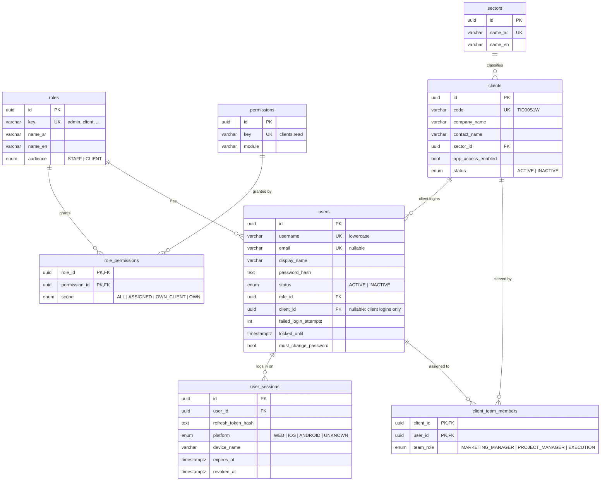

# 05 — Database design

> **Status:** full design for every module. Tables are **migrated per roadmap phase**. A phase adds the tables it needs in its own Prisma migration.
> Phase 1 (identity and access, plus the clients core) is the first migration: `init_identity_access`.
>
> Sources: the SRS, the technical plan, the Arabic plan PDF, and the **Figma file** (about 45 screens). Where Figma and the documents disagree, Figma wins, and the difference is noted.

## Stack

- **PostgreSQL 16**: relational integrity, plus `JSONB` only where the shape really varies (T-360 element metrics, TAPA answers, audit diffs)
- **Prisma 7** (`prisma-client` generator, `@prisma/adapter-pg` driver adapter)
- Local DB: `pnpm db:up` (Docker). The connection is `DATABASE_URL` in `apps/api/.env`.

## Conventions

| Topic                            | Rule                                                                                                                                                                 |
| -------------------------------- | -------------------------------------------------------------------------------------------------------------------------------------------------------------------- |
| Table names                      | `snake_case`, plural, via `@@map` (`client_team_members`)                                                                                                            |
| Column names                     | `snake_case` in the DB via `@map`; `camelCase` in Prisma and TypeScript                                                                                              |
| Primary keys                     | `id String @id @default(uuid(7)) @db.Uuid`. UUID v7 is time-ordered, so B-tree inserts stay sequential                                                               |
| Join tables                      | composite PK (`@@id([a_id, b_id])`), no surrogate id                                                                                                                 |
| Timestamps                       | `created_at`, `updated_at` as `@db.Timestamptz(3)` on entity tables; join and log tables keep only the timestamps they need. Dates use `@db.Date`                    |
| Soft delete                      | `deleted_at Timestamptz?` on business tables (users, clients, contracts, leads, …). Child and join tables are not soft-deleted                                       |
| Enums                            | Prisma enums for **fixed workflow states** (status, priority, type)                                                                                                  |
| Lookups                          | **Tables** for lists an admin may extend (sectors, job titles, SOW catalog, stage categories)                                                                        |
| Money                            | `Decimal @db.Decimal(14, 2)`, never `Float`. Currency defaults to SAR. VAT rate is stored on each invoice (`tax_rate`), never hard-coded                             |
| Scores                           | `Decimal @db.Decimal(3, 1)` with `CHECK (score BETWEEN 0 AND 10)` (T-360 and strategy sliders, step 0.5)                                                             |
| Foreign keys                     | Always indexed. `onDelete: Restrict` for business links, `Cascade` for owned children (sessions, join rows, line items)                                              |
| Files                            | One `files` table. Other tables hold a `*_file_id` FK. Files are downloaded only through permission-checked endpoints                                                |
| Derived data                     | Not stored unless it is a **snapshot** that must not change: for example, payslip totals once a payroll period is closed. "Lead month" is derived from `received_at` |
| Constraints Prisma can't express | `CHECK` constraints are added by hand to the generated migration SQL (`migrate dev --create-only`, edit, then apply)                                                 |
| Secrets                          | `password_hash` (argon2id) only. Refresh tokens are stored as an HMAC hash. Card data is a gateway token, `last4` and `brand` **only**                               |

## Module map

```
Identity & access ──┬── users ── user_sessions
                    └── roles ── role_permissions ── permissions
Clients core ─────── clients ── client_team_members ── users (staff)
                      │  └── users (client logins: owner / marketing / accountant)
                      ├── contracts ── work_plans ── work_plan_stages
                      ├── t360_assessments, competitors, strategic_plans
                      ├── client_sow_components, strike_campaigns, client_requests
                      ├── reports, campaign_metrics, meetings
                      ├── billing_plans, invoices, payments, payment_methods
                      ├── projects ── tasks, production_files, conversations
                      └── tapa_analyses
HR ───────────────── employees ── attendance, leave_requests, payslips, reviews
Leads ────────────── leads (Troofn's own ad leads; not tied to a client)
Cross-cutting ────── files, notifications, device_tokens, audit_logs
```

---

## Phase 1: Identity & access + clients core (migrated now)



### `roles`

One row per system role. `key` equals the `Role` enum value in `packages/shared`.

| Column            | Type                | Notes                                                                                                                 |
| ----------------- | ------------------- | --------------------------------------------------------------------------------------------------------------------- |
| id                | uuid PK             |                                                                                                                       |
| key               | varchar(50) UK      | `admin`, `client`, `client_marketing_officer`, `client_accountant`, `marketing_manager`, `content_writer`, `employee` |
| name_ar / name_en | varchar(100)        | Shown in the "صلاحيات التطبيق" dropdown (مدير / مدير التسويق / مدير الحسابات)                                         |
| audience          | enum `RoleAudience` | `STAFF` (Troofn) or `CLIENT` (a client company's login)                                                               |
| description       | text?               |                                                                                                                       |
| is_system         | bool                | System roles can't be deleted                                                                                         |

### `permissions`

The catalog of actions, as `module.action` keys (`clients.read`, `users.create`). It is seeded from `packages/shared/src/enums/permission.enum.ts`.

| Column      | Type            | Notes                             |
| ----------- | --------------- | --------------------------------- |
| id          | uuid PK         |                                   |
| key         | varchar(100) UK |                                   |
| module      | varchar(50)     | Groups permissions in docs and UI |
| description | text            |                                   |

### `role_permissions`

Which role may do what, and **on which rows** (`scope`):

| scope        | Meaning                                                                                              | Example                            |
| ------------ | ---------------------------------------------------------------------------------------------------- | ---------------------------------- |
| `ALL`        | every row                                                                                            | admin, `clients.read`              |
| `ASSIGNED`   | rows of clients or projects the user is assigned to (`client_team_members`, later `project_members`) | marketing manager, `clients.read`  |
| `OWN_CLIENT` | rows where `client_id = user.client_id`                                                              | client accountant, `invoices.read` |
| `OWN`        | rows that belong to the user                                                                         | employee, `tasks.read`             |

PK `(role_id, permission_id)`. Both FKs cascade.

### `users`

Every login: Troofn staff **and** client users. Figma: login is by **username** (`Wejnad#1`). Client users are created inside the client form, in the "صلاحيات التطبيق" block (role, username, password, status).

| Column                               | Type               | Notes                                                                                                                              |
| ------------------------------------ | ------------------ | ---------------------------------------------------------------------------------------------------------------------------------- |
| id                                   | uuid PK            |                                                                                                                                    |
| username                             | varchar(50) UK     | Stored lowercase. `CHECK (username = lower(username))`. Usernames are globally unique (SRS CLI-3)                                  |
| email                                | varchar(255)? UK   | Optional, stored lowercase (`CHECK`)                                                                                               |
| display_name                         | varchar(120)       | "Troofn Admin", "فهد القحطاني"                                                                                                     |
| phone                                | varchar(30)?       |                                                                                                                                    |
| password_hash                        | text               | argon2id. Never returned by the API                                                                                                |
| status                               | enum `UserStatus`  | `ACTIVE`, `INACTIVE` (the "الحالة" dropdown)                                                                                       |
| role_id                              | uuid FK → roles    | Restrict                                                                                                                           |
| client_id                            | uuid? FK → clients | Restrict. **Required for CLIENT roles, NULL for STAFF roles** (enforced in `UsersService`, because it depends on `roles.audience`) |
| must_change_password                 | bool               | Set by an admin password reset                                                                                                     |
| failed_login_attempts                | int                | `CHECK (>= 0)`. Reset on success                                                                                                   |
| locked_until                         | timestamptz?       | Lockout after N failures                                                                                                           |
| last_login_at                        | timestamptz?       |                                                                                                                                    |
| password_changed_at                  | timestamptz?       |                                                                                                                                    |
| created_by_id                        | uuid? FK → users   | SetNull                                                                                                                            |
| created_at / updated_at / deleted_at | timestamptz        |                                                                                                                                    |

Indexes: `role_id`, `client_id`.

### `user_sessions`

One row per login on a device. The refresh token **rotates inside the row**. The row is also the login history that the client **Activity** tab needs (device, last seen).

| Column                                 | Type                        | Notes                                                                                           |
| -------------------------------------- | --------------------------- | ----------------------------------------------------------------------------------------------- |
| id                                     | uuid PK                     | Also the first half of the refresh token (`<sessionId>.<secret>`)                               |
| user_id                                | uuid FK → users             | Cascade                                                                                         |
| refresh_token_hash                     | varchar(128)                | HMAC-SHA256 of the current secret                                                               |
| platform                               | enum `SessionPlatform`      | `WEB`, `IOS`, `ANDROID`, `UNKNOWN`                                                              |
| device_name                            | varchar(120)?               | "iPhone 15 Pro" (sent by Flutter)                                                               |
| user_agent                             | text?                       |                                                                                                 |
| ip_address                             | varchar(45)?                |                                                                                                 |
| created_at / last_used_at / expires_at | timestamptz                 | `expires_at` slides on each refresh; `CHECK (expires_at > created_at)`                          |
| revoked_at                             | timestamptz?                |                                                                                                 |
| revoke_reason                          | enum `SessionRevokeReason`? | `LOGOUT`, `LOGOUT_ALL`, `TOKEN_REUSE`, `PASSWORD_CHANGED`, `PASSWORD_RESET`, `USER_DEACTIVATED` |

Index: `user_id`.

### `sectors` (lookup)

The "التخصص" select: عقارات, سيارات, استشارات, … Columns: `id`, `name_ar` (UK), `name_en`.

### `clients`

The "بيانات العميل" form, plus the status dot and the "App Access" toggle.

| Column                               | Type                | Notes                                                                                |
| ------------------------------------ | ------------------- | ------------------------------------------------------------------------------------ |
| id                                   | uuid PK             |                                                                                      |
| code                                 | varchar(20) UK      | Identifier code "رمز التعريف" (`TID00S1W`)                                           |
| company_name                         | varchar(200)        | اسم الشركة                                                                           |
| contact_name                         | varchar(120)        | اسم العميل (contact person)                                                          |
| email                                | varchar(255)? UK    | Stored lowercase (`CHECK`)                                                           |
| phone                                | varchar(30)?        | Saudi format `+966…`                                                                 |
| website                              | varchar(255)?       |                                                                                      |
| sector_id                            | uuid? FK → sectors  | Restrict                                                                             |
| legal_representative                 | varchar(120)?       | الممثل القانوني                                                                      |
| drive_url                            | varchar(500)?       | ملف الدرايف (Google Drive link)                                                      |
| contract_start_date                  | date?               | تاريخ بداية العقد. See open question 8                                               |
| renewal_period_months                | smallint?           | فترة التجديد. `CHECK (> 0)`                                                          |
| app_access_enabled                   | bool                | The "App Access" toggle. When off, this client's users **cannot log in**             |
| status                               | enum `ClientStatus` | `ACTIVE` (green dot), `INACTIVE` (red dot). Client users can't log in while inactive |
| created_at / updated_at / deleted_at | timestamptz         |                                                                                      |

Phase 2 adds `logo_file_id` (صورة البروفايل) and `commercial_register_file_id` (السجل التجاري), once `files` exists.

### `client_team_members`

The client's Troofn team. Figma: "مدير التسويق" and "أضافة مدير للمشروع" in the client form; "مدير الحساب" and "فريق التنفيذ" in the overview's Work team card. This table **drives the `ASSIGNED` scope**.

| Column         | Type                  | Notes                                                                 |
| -------------- | --------------------- | --------------------------------------------------------------------- |
| client_id      | uuid PK, FK → clients | Cascade                                                               |
| user_id        | uuid PK, FK → users   | Cascade. Staff users only                                             |
| team_role      | enum `ClientTeamRole` | `MARKETING_MANAGER`, `PROJECT_MANAGER` (account manager), `EXECUTION` |
| assigned_at    | timestamptz           |                                                                       |
| assigned_by_id | uuid? FK → users      | SetNull                                                               |

Index: `user_id` (for "my clients").

---

## Phase 2: Files, contracts, work plans

### `files`

| Column                                                                      | Notes                                                                |
| --------------------------------------------------------------------------- | -------------------------------------------------------------------- |
| id, storage_key (UK), original_name, mime_type, size_bytes, checksum_sha256 | Stored outside the web root. `storage_key` is the path or object key |
| uploaded_by_id → users, created_at, deleted_at                              |                                                                      |

### `contracts`

The Contracts tab: Basic/Additional toggle, contract cards, the "Add contract" form, and the overview's contract info card.

| Column                               | Notes                                 |
| ------------------------------------ | ------------------------------------- |
| client_id → clients                  |                                       |
| code UK                              | `TRF-2026-0024`                       |
| title                                | "Troofn Master Service Contract"      |
| type                                 | enum `BASIC` / `ADDITIONAL`           |
| status                               | enum `ACTIVE` / `SUSPENDED` / `ENDED` |
| start_date, end_date                 | `CHECK (end_date >= start_date)`      |
| annual_value Decimal(14,2), currency | Feeds the overview KPIs and finance   |
| file_id → files                      | Contract PDF ("صورة العقد")           |

### `work_plans` → `work_plan_stages`

- `work_plans`: `contract_id`, `title` ("Addition Contract Work plan"). The number and date shown on the card come from the contract.
- `work_plan_stages`: `work_plan_id`, `title` (حملة رمضان), `start_date`, `end_date`, `status` enum `PENDING` (قادم) / `IN_PROGRESS` / `COMPLETED` (مكتمل), `completed_at`, `sort_order`. The "current" stage is derived, not stored.

---

## Phase 3: Central administration (T-360, strategy, SOW, documents)

### Shared lookup: `strategic_axes`

Seven fixed rows, used by **both** T-360 and the strategic plan: معلومات الشركة (company info), الفئة المستهدفة (target audience), وقت النشاط (activity time), الهوية البصرية (visual identity), المحتوى (content), تجربة المستخدم (user experience), اداء التسعير (pricing performance). Columns: `id`, `key` UK, `name_ar`, `name_en`, `sort_order`.

### T-360

- `t360_assessments`: `client_id`, `assessed_at`, `overall_score` (snapshot, shown as "8.9/10" on the overview), `created_by_id`. Keeping one row per assessment keeps the history.
- `t360_axis_results`: `assessment_id` (Cascade), `axis_id`, `score` 0–10, `summary` (نبذة), `note` (الملاحظة). UK `(assessment_id, axis_id)`.
- `t360_axis_elements`: `axis_result_id` (Cascade), `name` (الاسم التجاري), `value` (شقق تمليك), `rating?`, `description?`, `details jsonb?` (geographic scope, location percentages, measurement factor; its shape varies by element), `image_file_id?`, `sort_order`.
- `competitors`: `client_id`, `name`, `logo_file_id?`, `website?`, `rating` 0–10, `notes?`.
- `competitor_axis_scores`: PK `(competitor_id, axis_id)`, `score`. This is the radar overlay. It is normalized, not stored as `jsonb`.

### Strategic plan

The Facility Strategic Goal and Annual 7SC scope tabs.

- `strategic_plans`: `client_id` UK, `start_date` (بداية الخطة).
- `strategic_plan_axes`: `plan_id` (Cascade), `axis_id`, `current_score`, `target_score`. UK `(plan_id, axis_id)`.
- `strategic_plan_elements`: `plan_axis_id` (Cascade), `name` (الشعار / الاسم / رسالة البراند), `development_idea` (آلية التطوير), `sort_order`.
- `stage_categories` (lookup): "Premium Marketing", … See open question 5.
- `strategic_plan_stages`: `plan_id`, `title`, `stage_date` (month), `status` (PENDING/COMPLETED), `category_id?`, `description` (ما سيتم في المرحلة), `sort_order`.

### SOW

- `client_sow_versions`: PK `(client_id, version)`, where `version` is 1–4. These are the "SOW 1.0 … 4.0" toggles on the overview. See open question 4.
- `sow_component_categories` (lookup): Social Media, Content Creation, Video Production, Photography, Campaigns, Branding, Website, Reporting.
- `sow_component_catalog`: the "Component Library": `category_id`, `name`, `description`, `unit` (Designs, Videos, Sessions, Reports, Hours, Plans, Other), `default_frequency` enum `MONTHLY` / `QUARTERLY` / `ONE_TIME`, `is_active`.
- `client_sow_components`: the "Scope of Work components" grid: `client_id`, `catalog_item_id?` (null for a custom component), `name`, `description?`, `quantity?` (the "SOW III" column), `monthly_quantity?`, `quantity_label?` ("Included", "1-20S Video 2 shots"), `frequency`, `sort_order`.
- `campaign_item_types` (lookup): Main Ad, Carousel, Graphic Designs, Company Mobile Video, Website Article, AI Video, Smart UGC, each with `default_spec`.
- `strike_campaigns`: the monthly "7SC 01 … 12" points on the overview timeline: `client_id`, `sequence_no`, `month` (date), `status`.
- `strike_campaign_items`: `campaign_id` (Cascade), `item_type_id`, `spec` ("5 Slides + 2 Grid instagram cover"), `status` (PENDING / IN_PROGRESS / COMPLETED).
- `client_requests`: covers **both** SOW "Orders" and the plan's marketing/financial "Requests": `client_id`, `category` enum `MARKETING` / `FINANCIAL`, `title`, `description`, `priority` enum `LOW` / `MEDIUM` / `HIGH` / `URGENT`, `status` enum `PENDING_APPROVAL` / `IN_PROGRESS` / `COMPLETED` / `REJECTED`, `requested_by_id` → users, `requested_at`. See open question 9.
- `request_attachments`: PK `(request_id, file_id)`.

### Documents tab: reports, campaigns, meetings

- `reports`: `client_id`, `title` (تقرير أداء مايو 2026), `type` enum `MONTHLY_PERFORMANCE` / `CAMPAIGN`, `period_month` (date), `file_id`, `uploaded_by_id`.
- `campaign_metrics`: the "الحملات" table: `client_id`, `month` (date), `views`, `reach`, `clicks`, `followers`. UK `(client_id, month)`. The baseline ("البداية") is the first row.
- `meetings`: `client_id`, `title`, `starts_at`, `ends_at`, `meeting_url?`, `mode` enum `ONLINE` / `ONSITE`, `status` enum `REQUESTED` / `SCHEDULED` / `COMPLETED` / `CANCELLED`, `summary?` (تفاصيل وملخص الاجتماع), `requested_by_id`.

---

## Phase 4: HR and leads

### HR (the employee profile screens)

- `departments` (lookup), `job_titles` (lookup, `department_id`): مختص تسويق, مصممة جرافيك, مصور ومنتج, كاتب محتوى.
- `employees`: `user_id?` UK → users (the login; HR-1), `employee_code` UK, `full_name`, `job_title_id`, `hire_date`, `phone`, `email`, `base_salary` Decimal, `annual_leave_days`, `shift_id?`, `avatar_file_id?`, `status`, `deleted_at`. Rating and leave balance are **derived** from `performance_reviews` and `leave_requests`.
- `work_shifts`: `name`, `start_time`, `end_time`, `grace_minutes` (HR-3, configurable).
- `holidays`: `date` UK, `name`.
- `attendance_records`: `employee_id`, `work_date`, `check_in_at?`, `check_out_at?`, `status` enum `PRESENT` / `LATE` / `ABSENT` / `LEAVE` / `HOLIDAY`, `late_minutes`, `source` enum `FINGERPRINT` / `APP` / `MANUAL`. UK `(employee_id, work_date)`.
- `leave_types` (lookup), `leave_requests`: `employee_id`, `leave_type_id`, `start_date`, `end_date`, `status` enum `PENDING` / `APPROVED` / `REJECTED` / `CANCELLED`, `reason?`, `reviewed_by_id?`, `reviewed_at?`.
- `payroll_periods`: `month` UK (first day of the month), `status` `OPEN` / `CLOSED`, `closed_at`. A closed period is immutable (HR-2).
- `payslips`: `period_id`, `employee_id`, `base_salary`, `total_bonus`, `total_deductions`, `net` (a snapshot). UK `(period_id, employee_id)`.
- `payslip_adjustments`: `payslip_id` (Cascade), `type` `BONUS` / `DEDUCTION`, `amount`, `reason`.
- `performance_reviews`: `employee_id`, `period_start`, `period_end`, `rating` Decimal(2,1), `notes`, `reviewer_id`.

### Leads (the "وارد الاعلانات" inbox: Troofn's own ad leads)

- `leads`: `full_name`, `phone`, `phone_normalized`, `source` enum `GOOGLE_ADS` / `FACEBOOK` / `INSTAGRAM` / `TIKTOK` / `MANUAL`, `campaign_name?`, `external_id?`, `status` enum `NEW` (جديد) / `CONTACTED` (تم التواصل) / `INTERESTED` (مهتم) / `CONVERTED` (تم التحويل), `received_at`, `contacted_at?`, `contacted_by_id?`, `notes?`, `raw_payload jsonb?`, `deleted_at`.
  - UK `(source, external_id)` for webhook idempotency.
  - Indexes: `received_at` (the month sidebar), `status`, `phone_normalized` (dedupe, LEAD-4).
- `lead_status_history`: `lead_id`, `from_status`, `to_status`, `changed_by_id`, `changed_at`, `note?`.

---

## Phase 5: Projects, tasks, production, TAPA, chat

- `projects`: `client_id`, `title` (حملة الصيف 2026), `type` enum `CAMPAIGN` / `STRATEGIC` / `CONTENT`, `status`, `start_date`, `end_date`. Progress % is derived from tasks.
- `project_members`: PK `(project_id, user_id)`, `member_role`. Drives `ASSIGNED` for project-level permissions.
- `tasks`: `client_id`, `project_id?`, `title`, `description?`, `priority` (`LOW` / `MEDIUM` / `HIGH` / `URGENT`), `status` enum `PENDING` / `IN_PROGRESS` / `ON_HOLD` / `COMPLETED`, `due_date`, `assignee_id` → users, `created_by_id`, `completed_at`. One table serves the HR Tasks tab and Flutter's "my tasks".
- `production_files`: `project_id`, `strike_campaign_item_id?`, `element_type` (Main Ad, Carousel, …, Website Article, Content Plan), `file_id`, `status`, `version`, `uploaded_by_id`.
- `tapa_analyses`: `client_id` UK, `updated_by_id`. `tapa_axis_answers`: PK `(analysis_id, axis_key)`, `data jsonb`. TAPA has 8 axes whose fields are not designed yet.
- `conversations`: `type` enum `CLIENT_SUPPORT` (the Support tab: client ↔ project manager) / `PROJECT_TEAM` (team chat), `client_id`, `project_id?`.
- `conversation_participants`: PK `(conversation_id, user_id)`, `can_send`, `last_read_at` (gives the unread badges).
- `messages`: `conversation_id`, `sender_id`, `body`, `created_at`, `edited_at?`, `deleted_at?`. Index `(conversation_id, created_at)` for `?after=` polling.
- `message_attachments`: PK `(message_id, file_id)`. This is "رفع مستند" in Support.

## Phase 6: Finance (Financial tab and the Documents → invoices/transfers tabs)

- `billing_plans`: `client_id`, `kind` enum `BASIC` / `PROPOSAL` (the "الاساسي / المقترح" toggle), `valid_from`.
- `billing_plan_items`: `plan_id` (Cascade), `label` (تحليل T360, الاشتراك الشهري, Google Ads), `amount`, `recurrence` enum `ONE_TIME` / `MONTHLY` / `YEARLY`, `kind` enum `SERVICE` / `AD_BUDGET`.
- `billing_plan_active_months`: PK `(plan_id, month 1..12)`. These are the "الاشهر الفعالة للترويج" (active promotion months).
- `invoices`: `client_id`, `contract_id?`, `number` UK, `title`, `issue_date`, `due_date`, `subtotal`, `tax_rate` (0.15), `tax_amount`, `total`, `status` enum `DRAFT` / `ISSUED` / `PARTIALLY_PAID` / `PAID` / `OVERDUE` / `CANCELLED`, `file_id?`.
- `payments` (the "الحوالات" transfers): `client_id`, `invoice_id?`, `reference` UK (`#mk12213132`), `amount`, `paid_at`, `method` enum `BANK_TRANSFER` / `CARD`, `receipt_file_id?`, `status` enum `PENDING_REVIEW` / `CONFIRMED` / `REJECTED`, `recorded_by_id`.
- `payment_methods`: `client_id`, `gateway`, `gateway_token`, `brand`, `last4`, `holder_name`, `exp_month`, `exp_year`, `is_default`. Figma's promotion card form shows the card number and CVV. **Those are sent to the gateway and never stored.**

## Cross-cutting (added with the module that first needs it)

- `notifications`: `user_id`, `type`, `title`, `body`, `data jsonb`, `read_at?`, `created_at`. Index `(user_id, read_at)`; this is the bell badge.
- `device_tokens`: `user_id`, `session_id?`, `token` UK, `platform`, `last_seen_at` (FCM).
- `audit_logs`: `actor_user_id?`, `client_id?`, `entity_type`, `entity_id`, `action`, `changes jsonb`, `ip_address`, `created_at`. Indexes `(client_id, created_at)` and `(entity_type, entity_id)`.
- `app_sessions` and `app_screen_views`: the client **Activity** tab (sessions per period, average duration, most-visited and most-bounced screens, devices). Flutter sends these events.

---

## Open business questions (each blocks only its own module)

1. Formulas for the overview KPI cards: amount due, operating amount %, profit margin %, pivot capacity %, annual profit %.
2. Lead intake: webhooks (Meta, Google, TikTok) or manual entry only?
3. Chat: polling (the default) or Socket.io?
4. SOW 1.0–4.0: feature flags per client (as modelled), or contract tiers?
5. Strategic stage categories ("Premium Marketing"): is it a fixed list?
6. Attendance source: fingerprint device or app check-in?
7. Payment gateway for card tokenization.
8. The client form has "contract start date" and "renewal period". Are these the client relationship's master terms (as modelled), or should they come from the basic contract?
9. Are SOW "Orders" the same thing as the client app's marketing "Requests"? They are modelled as one table, `client_requests`.

## Workflow

```bash
pnpm db:up                                           # start Postgres (Docker)
cd apps/api
pnpm prisma:migrate --create-only --name <name>      # generate SQL only; review / add CHECKs
pnpm prisma:migrate                                  # apply it and regenerate the client
pnpm db:seed                                         # roles, permissions, demo data
pnpm prisma:studio                                   # browse data
```

- **Never edit a migration that has already been applied.** Create a new one.
- Commit `prisma/migrations/**` together with the schema change.
- Staging and production run `pnpm prisma:deploy`, which applies pending migrations only.
